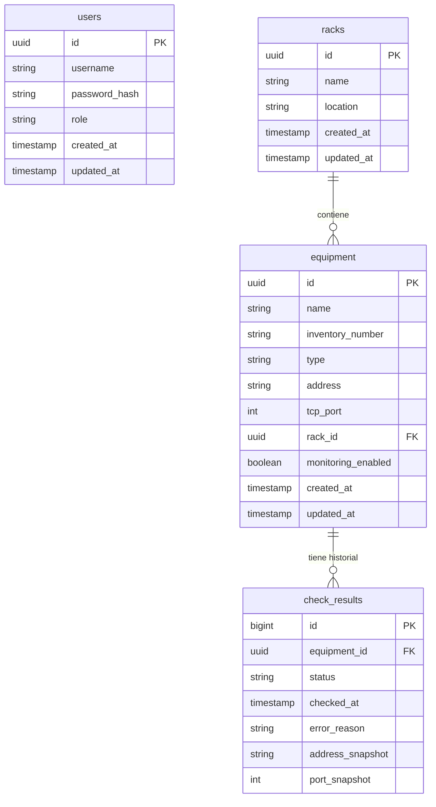

```mermaid
erDiagram
    users {
        uuid id PK
        string username
        string password_hash
        string role
        timestamp created_at
        timestamp updated_at
    }
    racks {
        uuid id PK
        string name
        string location
        timestamp created_at
        timestamp updated_at
    }
    equipment {
        uuid id PK
        string name
        string inventory_number
        string type
        string address
        int tcp_port
        uuid rack_id FK
        boolean monitoring_enabled
        timestamp created_at
        timestamp updated_at
    }
    check_results {
        bigint id PK
        uuid equipment_id FK
        string status
        timestamp checked_at
        string error_reason
        string address_snapshot
        int port_snapshot
    }

    racks ||--o{ equipment : "contiene"
    equipment ||--o{ check_results : "tiene historial"
```    